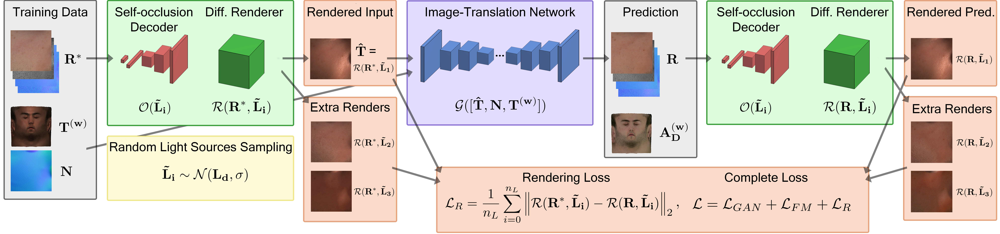

# [AvatarMe: Realistically Renderable 3D Facial Reconstruction "in-the-wild"](https://arxiv.org/abs/2003.13845):
[](https://www.youtube.com/watch?v=fEsgeZPN8Uw)
[](https://arxiv.org/pdf/2003.13845.pdf)

Published in the IEEE/CVF Conference on Computer Vision and Pattern Recognition (__[CVPR 2020](https://openaccess.thecvf.com/content_CVPR_2020/html/Lattas_AvatarMe_Realistically_Renderable_3D_Facial_Reconstruction_In-the-Wild_CVPR_2020_paper.html)__)

# [AvatarMe++: Facial Shape and BRDF Inference with Photorealistic Rendering-Aware GANs](https://arxiv.org/abs/2112.05957):
[](#)
[](https://arxiv.org/abs/2112.05957)

Published in IEEE Transaction on Pattern Analysis and Machine Intelligence (__[TPAMI 2021](https://ieeexplore.ieee.org/abstract/document/9606538)__)

[Alexandros Lattas](https://www.imperial.ac.uk/people/a.lattas),
[Stylianos Moschoglou](https://www.doc.ic.ac.uk/~sm3515/),
[Stylianos Ploumpis](https://www.imperial.ac.uk/people/s.ploumpis),
[Baris Gecer](http://barisgecer.github.io),<br>
[Abhijeet Ghosh](https://www.doc.ic.ac.uk/~ghosh/),
[Stefanos Zafeiriou](https://wp.doc.ic.ac.uk/szafeiri/)
<br/>
Imperial College London
<br/>


## Overview


<br>

AvatarMe++ is a new method for reconstructing renderable photorealistic 3D faces from a single ‘in-the-wild”. 
Extending on AvatarMe we define a fast facial photorealistic differentiable rendering methodology 
with accurate facial skin diffuse and specular reflection, 
self-occlusion and subsurface scattering approximation. 
With this, we train a network that disentangles the facial diffuse and specular BRDF components 
from a shape and texture with baked illumination, reconstructed with a state-of-the-art 3DMM fitting method. 

<br>

## Method


<br>

Summary of the AvatarMe++ method: 
We acquire a 3DMM fitting and upscale its texture using a state-of-the-art super resolution network,
trained on synthetic data rendered in the texture’s domain. 
A image-translation network is then used to transform the upscaled texture and normals to
reflectance maps, namely the Diffuse Albedo, Specular Albedo, Diffuse Normals and Specular Normals.

<br>



We create a rendering module, 
with subsurface-scattering and self-occlusion approximation. 
During training, it is used to create synthetic data pairs, 
by rendering the captured data in the target’s environment and random ones, 
which are used for photorealistic rendering loss. 
The complete high resolution (up to 6k×4k) BRDF maps can be used for photorealistic rendering, 
while the specular normals can be used to enhance the original geometry with fine details.

<br>

## Results


<br>

Our high resolution mesh and reflectance textures 
(Diffuse Albedo, Specular Albedo, Diffuse Normals, Specular Normals)
can be used with most open-source or commercial renderers
to render the reconstructed subjects in various illumination environments.

<br>


Thanks to the photorealistic differentiable renderer and the stochastic rendering loss,
in contrast to AvatarMe, AvatarMe++ can be generalize for most examples with frontal facing illumination. 
As shown above, AvatarMe++ can be effectively used in reconstructions with
([Chen et al., 2019](https://openaccess.thecvf.com/content_ICCV_2019/papers/Chen_Photo-Realistic_Facial_Details_Synthesis_From_Single_Image_ICCV_2019_paper.pdf)),
([Gecer et al., 2021](https://openaccess.thecvf.com/content/CVPR2021/html/Gecer_OSTeC_One-Shot_Texture_Completion_CVPR_2021_paper.html))
and datasets such as 
[Facescape](https://facescape.nju.edu.cn/),
[Superface](https://www.micc.unifi.it/resources/datasets/florence-superface/)
and subjects captured with a [3dMD](https://3dmd.com/) device. 

<br>

## Citation
If you find this work useful in your research,
please cite our papers [AvatarMe](http://openaccess.thecvf.com/content_CVPR_2020/html/Lattas_AvatarMe_Realistically_Renderable_3D_Facial_Reconstruction_In-the-Wild_CVPR_2020_paper.html),
[AvatarMe++](https://ieeexplore.ieee.org/abstract/document/9606538/) using:
```
@InProceedings{lattas2020avatarme,
  author = {Lattas, Alexandros and Moschoglou, Stylianos and Gecer, Baris and Ploumpis, Stylianos and Triantafyllou, Vasileios and Ghosh, Abhijeet and Zafeiriou, Stefanos},
  title = {AvatarMe: Realistically Renderable 3D Facial Reconstruction "In-the-Wild"},
  booktitle = {Proceedings of the IEEE/CVF Conference on Computer Vision and Pattern Recognition (CVPR)},
  month = {June},
  year = {2020}
}

@article{lattas2021avatarme++,
  title={AvatarMe++: Facial Shape and BRDF Inference with Photorealistic Rendering-Aware GANs},
  author={Lattas, Alexandros and Moschoglou, Stylianos and Ploumpis, Stylianos and Gecer, Baris and Ghosh, Abhijeet and Zafeiriou, Stefanos P},
  journal={IEEE Transactions on Pattern Analysis and Machine Intelligence},
  year={2021},
  publisher={IEEE}
}
```

## Contact
For any enquiries please contact the first author at the email listed on the above papers. 
